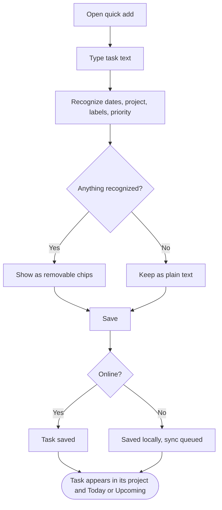

# Example: `/product/flows/add-task.md`

Same fictional task manager as the Feature Map example. Note: the diagram is readable in seconds, behavior details exist only where a node needs them, implementation references are last and skippable.

````md
---
id: add-task
title: Add a task
features:
  - add-task
  - projects
  - scheduling
status: active
---

# Add a task

## Goal

Capture a task in a few seconds from anywhere in the app, with its date, project, labels and priority understood from plain text, so it shows up in the right place without extra clicks.

## Flow



## Behavior details

#### Recognize dates, project, labels, priority

Runs as the user types. Examples: "tomorrow 9am", "every monday", "#Work", "@email", "p1".

**Result**
- Recognized parts are highlighted inline and shown as chips below the field
- Removing a chip keeps the words as plain text and stops re-recognizing them for this task

**Possible outcomes**
- ⚠️ Behavior unclear from the current implementation. Whether recognition follows the account language or the device locale when they differ is not covered by the UI or tests.

#### Save

**Requires**
- Task text is not empty after chips are removed

**Result**
- Project defaults to Inbox when none was chosen
- Due date is left empty when none was recognized
- Quick add closes, or stays open with an empty field when "Add another" was toggled

#### Online?

**Possible outcomes**
- Online: task is saved and visible on other devices within a few seconds
- Offline: task is kept locally with an "offline" badge and synced when the connection returns; if the server rejects it on sync, the task stays local and an error banner offers Retry

## Related features

- [Add a task](../features.md#add-a-task)
- [Organize tasks in projects and sections](../features.md#organize-tasks-in-projects-and-sections)
- [Schedule and reschedule](../features.md#schedule-and-reschedule)

## Related flows

- [Get started](onboarding.md): new users are dropped into quick add after signup.
- [Plan the day](plan-the-day.md): where the task is seen next if it has a date.

## Implementation references

- Quick add UI: `src/features/quick-add/QuickAdd.tsx`
- Text recognition: `parseTaskText` in `src/lib/parse-task-text.ts`
- Offline queue: `src/sync/outbox.ts`
- Tests: `src/lib/parse-task-text.test.ts`, `e2e/quick-add.spec.ts`
````

What makes this good
- Thirteen nodes, one main path, two branches a user can actually tell apart (recognized or not, online or not).
- Decisions are phrased as questions with labeled edges.
- Details only where the label is not enough; the honest `⚠️` marker instead of a guess.
- Links go both ways: to feature anchors and to neighbouring flows.
