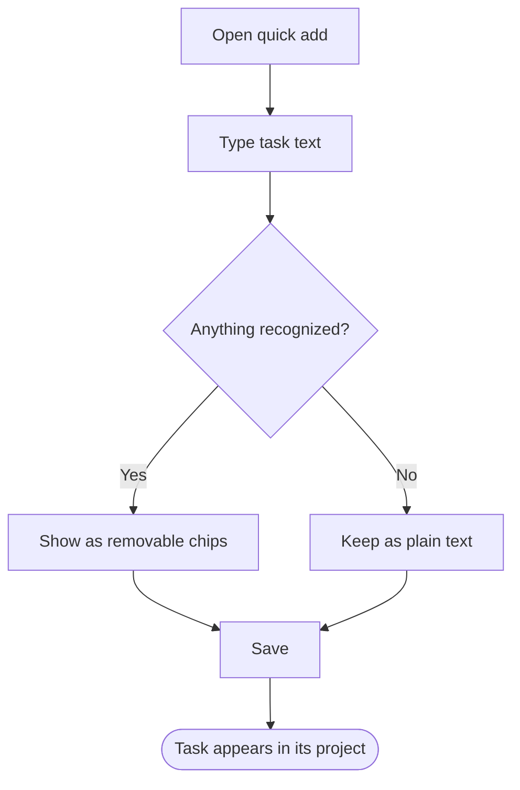

# Product Map format

This is the contract for the `/product` folder. Humans read it; coding agents and the `@nuthinking/product-map` viewer parse it. Keep to it so tooling keeps working.

Contents
1. IDs and links
2. `/product/README.md`
3. `/product/features.md` (Feature Map)
4. `/product/flows/<flow-id>.md` (Product Flows)
5. Mermaid conventions
6. Status values and markers

---

## 1. IDs and links

- IDs are kebab-case: lowercase letters, digits and hyphens, for example `create-project`, `two-factor-login`.
- Feature IDs are unique across `features.md`. Flow IDs are unique across `flows/` and equal the file name without `.md`.
- IDs are stable. Rename one only when the concept itself changes, and update every reference in the same change.
- Links between Product Map files are relative Markdown links: `[Create a project](flows/create-project.md)` from `README.md` or `features.md`; `[Feature Map](../features.md#create-a-project)` or `[Publish a site](publish-site.md)` from inside `flows/`.
- Feature anchors are the GitHub-style slug of the feature heading: `### Create a project` becomes `#create-a-project`.
- Paths to code in implementation references are relative to the repo root, in backticks.

## 2. `/product/README.md`

The one-minute overview. Someone who has never seen the app should finish it knowing what the product is, who uses it (when apparent), its major capabilities and its major flows. Keep it under roughly 60 lines.

```md
# <Product name>

<One or two sentences: what the product is and who uses it.>

## Major capabilities

- **<Area>**: <one line summarising the area>. See [Feature Map](features.md#area-slug).
- ...

## Major flows

- [<Flow title>](flows/<flow-id>.md): <one line on the goal>
- ...

## About this folder

This is the Product Map: a description of what the product does and how it behaves, maintained alongside the code. `features.md` lists capabilities; `flows/` shows how users accomplish goals. Keep it about observable behavior, not implementation. Validate with `<validation command>`.
```

For `<validation command>` use the same repo-portable command as in `AGENTS.md` (see `agent-instructions.md`); never a machine-specific absolute path.

Every flow file must be linked from the README. Every area in `features.md` should be mentioned. An optional short section such as `## Known gaps` or `## Things worth knowing` may sit before *About this folder* for things a newcomer should hear first: broken capabilities, optional services the product degrades without, notable limits.

## 3. `/product/features.md` (Feature Map)

Answers "What can this product do?". Features are grouped under product areas (`##`). Each feature is a `###` heading followed by a short bold-label list. The `**ID:**` line is required; the others are optional but `Description` and `Flows` are almost always worth having.

```md
# Feature Map

<Optional one-line intro.>

## <Area name>

<Optional one line describing the area.>

### <Feature name>
**ID:** `feature-id`
**Description:** <One or two sentences on what the user can do and what happens.>
**Entry:** <Where or how the user reaches it, for example "Dashboard → New project", "/settings/billing", "Share menu on any document".>
**Flows:** [<Flow title>](flows/<flow-id>.md), [<Flow title>](flows/<flow-id>.md)
**Status:** active
**Implementation:** `src/app/projects/new/page.tsx`, `src/server/projects.ts`
```

Rules
- One `### ` heading per feature; the heading is the feature name as a user would say it.
- `**ID:**` must be on its own line directly under the heading (blank lines allowed), with the ID in backticks.
- `**Flows:**` lists links to the flows that exercise the feature, mirroring those flows' `features` lists. A feature with no flow is allowed (for example a setting), but if many features have no flow, a flow is probably missing.
- `**Status:**` defaults to `active` when omitted. See section 6.
- `**Implementation:**` is a short comma-separated list of paths or symbols. Keep it to the few places an agent would start from. Not every feature needs it.
- Areas are for scanning: 3 to 8 areas is typical. Do not nest areas.
- Order areas and features roughly by how central they are to the product, or by the order a user meets them.

## 4. `/product/flows/<flow-id>.md` (Product Flows)

One file per major flow. Required frontmatter: `id`, `title`, `features`, `status`.

````md
---
id: add-task
title: Add a task
features:
  - add-task
  - projects
  - scheduling
status: active
---

# Add a task

## Goal

<1 to 3 sentences: what the user is trying to achieve and roughly how the product gets them there.>

## Flow



## Behavior details

#### Save

**Trigger**
User presses Enter or selects Add task.

**Requires**
- Task text is not empty

**Result**
- Project defaults to Inbox when none was chosen
- Quick add closes

**Possible outcomes**
- Saved and visible immediately
- Offline: saved locally and synced later
- Server rejects on sync: task stays local, error banner offers Retry

## Related features

- [Add a task](../features.md#add-a-task)
- [Organize tasks in projects and sections](../features.md#organize-tasks-in-projects-and-sections)

## Related flows

- [Plan the day](plan-the-day.md): where a dated task is seen next.

## Implementation references

- Route or screen: `src/features/quick-add/QuickAdd.tsx`
- Logic: `parseTaskText` in `src/lib/parse-task-text.ts`
- Tests: `e2e/quick-add.spec.ts`
````

Rules
- `features` lists feature IDs from `features.md`. Every ID must exist. List the features the flow actually exercises, not every feature it touches in passing.
- The `## Flow` section holds exactly one Mermaid flowchart. It is the primary artifact; everything else supports it.
- `## Behavior details` uses `####` sub-headings that match a node label or a transition. Include only the nodes that need more than their label. Use the compact labels **Trigger**, **Requires**, **Result**, **Possible outcomes**; omit labels that add nothing.
- `## Related features` links back to the Feature Map anchors. `## Related flows` links to sibling flow files, with a few words on the relationship (precedes, continues, alternative to).
- `## Implementation references` is last and optional. The flow must still read correctly if it is removed.
- Where behavior could not be determined, write `⚠️ Behavior unclear from the current implementation.` at the exact point of uncertainty, optionally followed by what evidence would resolve it.

## 5. Mermaid conventions

The goal is a diagram a person understands in about ten seconds.

- Use `flowchart TD`. Use `flowchart LR` only for short, mostly linear flows.
- Roughly 6 to 15 nodes. Above about 20, split the flow.
- Node shapes carry meaning:
  - `[User action or system step]` rectangle
  - `{Decision?}` diamond, with `-->|Yes|` / `-->|No|` or other short edge labels on each branch
  - `([Outcome or end state])` stadium for the terminal states of the flow
  - `[/Error shown/]` parallelogram for failures users see, optional
- Node IDs are short (`A`, `B`, or kebab words). Never use `end`, `graph`, `subgraph`, `style`, `class`, `click` or `default` as a node ID.
- Labels are 2 to 6 words. Quote any label containing `(`, `)`, `[`, `]`, `{`, `}`, `"`, `|`, `#`, `;` or `<`: `A["Export (PDF)"]`. Apostrophes, commas, periods, `%`, `&`, `→` and other plain text are fine unquoted.
- Show at most the branches a user can tell apart. Retries loop back with a plain edge. Do not draw every validation message as a node; one `Show validation errors` node with a loop back is enough.
- Subgraphs are allowed sparingly to group a sub-area, but if you need several, that is a sign to split the flow.
- No styling, themes, or `classDef` in Product Map diagrams. Keep them portable.

## 6. Status values and markers

`status` on flows, and `**Status:**` on features, is one of:

| Value | Meaning |
|---|---|
| `active` | Shipped and reachable by users (possibly behind a flag; say so in the description). Default. A capability that is currently broken stays `active` with a `⚠️ UI and code disagree:` note; status describes intent, the marker describes reality. |
| `planned` | Documented ahead of implementation, for example from a spec. Must not be confused with shipped behavior. |
| `deprecated` | Still exists for some users or is being removed. Say what replaces it. |

Markers used inside any file:

- `⚠️ Behavior unclear from the current implementation.` Exactly this text, so it can be searched and the viewer can surface it.
- `⚠️ UI and code disagree:` followed by what users see and what the code suggests. Exactly this prefix, so it can be counted and surfaced.
