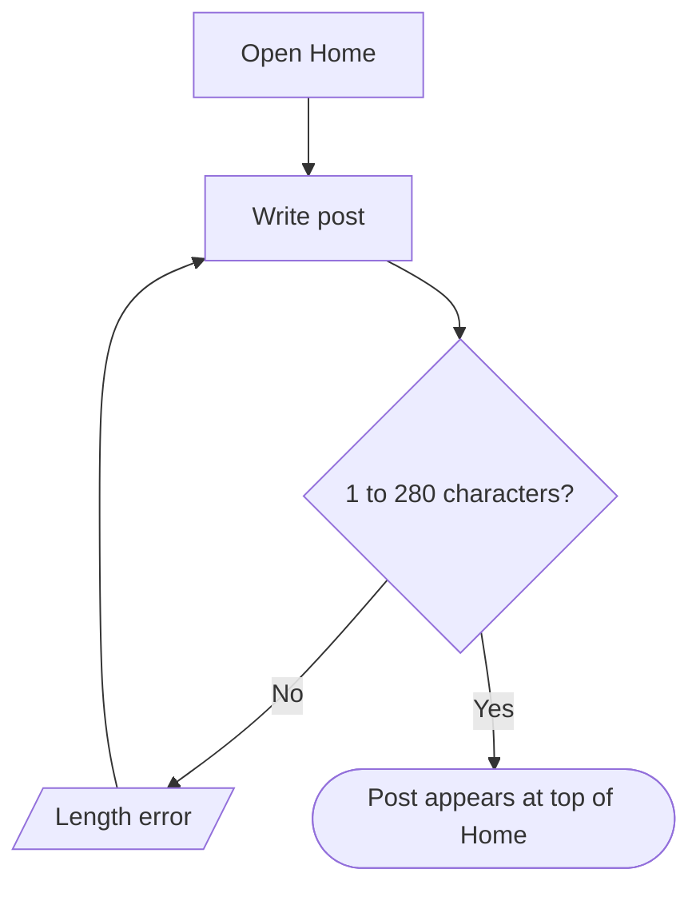

# Product behavior section for pull requests

GitHub (and GitLab) render ```mermaid blocks in PR descriptions and comments, but not in the diff view. A reviewer who only sees changed lines of Mermaid source cannot picture the flow. Putting the rendered diagram in the PR body lets them check the behavior change in a glance, before reading code.

Add this section to the PR description whenever the change touches `/product`. Keep it short; it is a summary, not a copy of the map.

````md
## Product behavior

<One to three bullets, each "before → after" in user terms.>
- Posts can now be up to 280 characters (was 140).
- Authors can no longer delete an article from the article page.

Updated flows: [Share a post](../blob/<branch>/product/flows/share-post.md), [Edit your article](../blob/<branch>/product/flows/manage-article.md)

<details>
<summary>Share a post (updated)</summary>



</details>
````

Rules
- Bullets describe what changed for users, not which files changed. "Before → after" phrasing makes the delta obvious.
- Link each affected flow file at its branch URL (`https://github.com/<owner>/<repo>/blob/<branch>/product/flows/<id>.md`) so the reviewer can open the rendered page. Use the real owner, repo and branch; do not guess.
- Include the updated diagram inline inside a collapsed `<details>` block per flow, so long PR bodies stay scannable. When the diagram's structure changed (nodes, edges, branches), include both the previous and the updated diagram, labeled, so the reviewer can compare. For a relabeled node, the updated one is enough.
- For a brand-new Product Map, replace the bullets with one line ("Adds a Product Map: N features, M flows; start at `product/README.md`") and link the README instead of pasting every diagram.
- Nested fences: the outer block in a PR body is plain text, so a ```mermaid fence inside it works. If the tool you use to write the PR body mangles nested fences, write the body to a file and pass it with `--body-file`.
